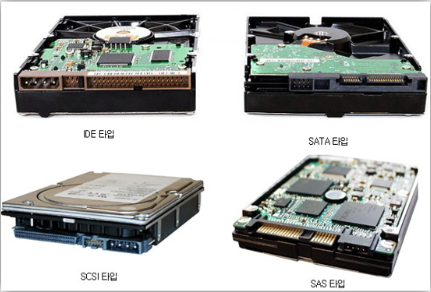
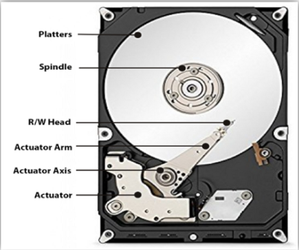
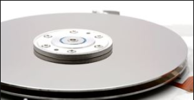
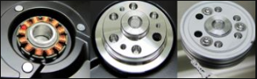
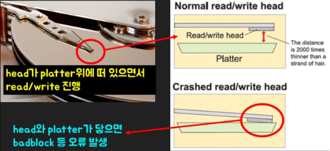
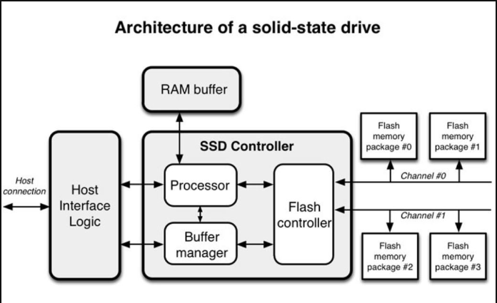
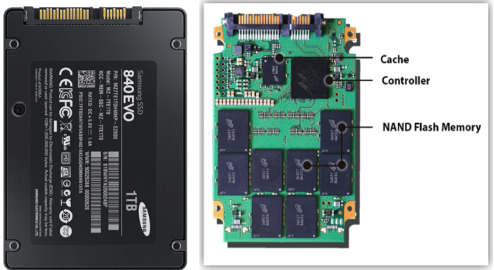

# 1.보조 저장 장치 

보조기억장치는 물리적인 디스크가 연결되어 있는 기억장치입니다.
주기억장치보다는 느리지만 컴퓨터의 전원을 끄더라도 저장된 데이터가 사라지지 않고 영구적으로 보관할 수 있는 장치입니다.

# 2. HDD
 

HHD에는 IDE 타입, SATA 타입, SCSI 타입, SAS 타입이 있다.

## 2.1. HDD 구조

 

### 2.1.1. Platter
 
데이터를 저장하는 역할.Platter의 표면은 마그네틱 산화철로 코딩되어 있어 Head가 자성을 이용해 1과 0으로 데이터를 저장한다.

### 2.1.2. Spindle
 
 Spindle의 내부
공작 기계에서 공작물 또는 연장을 회전시키기위한 축.
platter를 돌아가게해주는 모터.
spindle 도는 속도에 따라서 HDD의 RPM 결정됨.
RPM이 높을 수록 HDD가 빨리 돌기 때문에 READ/WRITE를 더 빠르게 수행할 수 있다.
RPM이란 회전하면서 일을 하는 장치가 1분동안 몇 번의 회전을 하는지 나타내는 단위

### 2.1.3. Header
 
Head는 Platter 위에 떠 있으면서 데이터를 READ/WRITE하는 역할입니다.
Head와 Platter 사이의 간격은 머리카락 1/2000 크기로 매우 좁다.
만약 Head와 Platter가 닿게 되면 Badblock이나 데이터 유실같은 오류가 발생한다.

### 2.1.4. Actuator
동력을 이용하여 기계를 동작시키는 구동 장치.
Actuator가 Head를 좌우로 이동시키면서 데이터에 접근해서 Head가 Platter의 데이터를 READ/WRITE 읽고 쓰고 한다.

# 3. SSD

플래시 메모리를 사용하고 반도체 기반의 정보를 저장하는 기억장치 물리적으로 데이터를 저장하지 않고 전기적으로 데이터를 저장하기 때문에 
HDD에 비해 속도가 빠르며 소음도 발생하지 않으며 전력소모가 적고 경량화, 소형화가 가능 하지만 HDD에 비해 다소 가격이 높은 편이다.
 

## 3.1. SSD 구조

 

