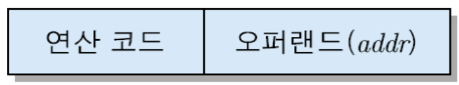

# 목차 
[1. CPU 기본 구조](#cpu의-기본-구조-link)  
[2. 명령어 실행](#명령어-실행-instruction-cycle-link)  
[2.1. 인출 사이클](#1-인출-사이클-link)  
[2.2. 실행 사이클](#2-실행-사이클-link)  
[2.3. 인터럽트 사이클](#3-인터럽트-사이클-link)  
[2.4. 간접 사이클](#4-간접-사이클)  
[3. 명령어 파이프라이닝](#파이프라이닝이란)  
[3.1. 슈퍼 스칼라](#31-슈퍼-스칼라란)  
[4. 명령어 세트](#4-명령어-세트란)  
[4.1. 명령어 구성요소](#41-명령어-구성-요소-동작코드--오퍼랜드)  
[4.2. 명령어 형식](#42-명령어-형식)  
[4.3. 주소지정 방식](#43-주소지정-방식)  

# 1. CPU의 기본 구조 [link](https://bit.ly/CPU_Structure)
CPU는 중앙 처리 장치 (Central Processing Unit)로 컴퓨터에서 가장 중요한 역할을 담당한다. 

**- CPU의 기본 구성 및 구조는 아래와 같이 구분할 수 있다.** 
 
*1. 산술논리연산장치 (Arithmetic and Logical Unit: 이하 ALU)* 
*2. 레지스터 세트 (Register Set)* 
*3. 제어 유니트 (Control Unit)*

### 1. ALU
    각종 산술 연산 및 논리 연산을 수행하는 하드웨어 모듈.
    사칙연산과 함께 논리 연산 (AND,OR, XOR, NOT 등)을 구분할 수 있다.
 

### 2. 레지스터 
    CPU에서 사용하는 기억 장치로 CPU 접근 속도가 가장 빠르다.
    단, CPU 내부에 존재하는 만큼 포함할 수 있는 갯수와 크기가 제한되는데,
    레지스터는 ❶ 특수 목적, ❷ 일반 목적용으로 구분할 수 있다.

다양한 레지스터 리스트

 
1. 프로그램 카운터 (Program Counter)

 

### 3. 제어 유니트 
    프로그램 코드 (명령어)를 해석하고 실행하기 위한
    제어 신호(control signal)를 순차적으로 발생시키는 하드웨어 모듈.
 

### 4. 번외 - CPU 내부 버스(CPU Internal Bus) 
    버스는 데이터와 제어 신호 등을 전달하는 회로로 정보를 위한 통로라 생각하면 쉽다.
    CPU 내부 버스는 CPU를 구성하는 장치들과 레지스터 간의 데이터 이동을 돕는 버스이다.
    외부의 시스템 버스(입출력 장치, 주/보조 기억장치 등)과 연결되지 않으며
    버퍼 레지스터 또는 시스템 버스 인터페이스 회로를 통해 시스템 버스와 접속을 한다.

  

# 2. 명령어 실행 (Instruction Cycle) [link](https://bit.ly/Instruction_Cycle)
 
 
    한 개의 명령어를 실행하는데 필요한 전체 처리 과정을 의미한다.
    CPU는 명령어 실행을 컴퓨터의 전원이 끊기거나 치명적인 오류가 발생하기 전까지 무한 반복한다.
    명령어 실행은 2가지 단계로 나뉘는데, 이를 '인출 사이클'과 '실행 사이클'이라 칭한다.

CPU는 해당 명령어를 실행하는 과정에서 사용하는 레지스터들이 있다!

 

1. **프로그램 카운터 (Program Counter - 이하 PC)** 
다음 fetch할 명령어의 주소를 담고 있는 레지스터

2. **누산기 (Accumulator - 이하 AC)** 
데이터를 임시적으로 저장하는 temp 레지스터

3. **명령어 레지스터 (Instruction Register - 이하 IR)** 
가장 최근 인출된 명령어 코드가 저장되어 있는 레지스터

4. **기억장치 주소 레지스터 (Memory Address Register - 이하 MAR)** 
PC에 저장된 명령어 주소가 시스템 주소 버스로 출력되기 전, 
일시적으로 저장되는 주소 레지스터

5. **기억장치 버퍼 레지스터 (Memory Buffer Register - 이하 MBR)** 
기억장치로부터 읽혀진 데이터를 일시적으로 저장하는 버퍼 레지스터

더 들어가기 전 - CPU 클럭

 
클럭이란 일반적으로 디지털 시스템에 내장되어 있는 전자 회로 또는 장치를 의미한다.
해당 장치는 모든 동작들이 어긋나지 않고 화합을 이룰 수 있도록 동기화 과정에 있어 동작 시간을 조절하고 시간을 알리는 역할을 한다.

하지만, CPU에서는 클럭은 CPU의 속도를 나타내는 단위로 사용된다!
기기별로 동기화하기 위해 발생시키는 전자 펄스를 일종의 타이밍 신호로 인식, 클럭 속도라 하는데 - 1MHz는 초당 100만 주기의 속도를 나타낸다.

따라서, 간단하게 이해하면 클럭 수치를 통해 CPU가
1초에 얼마나 많은 움직임이 발생하고 얼만큼의 데이터 양을 처리하는지 확인이 가능하다. (CPU는 일반적으로 1GHz의 클럭을 가진다. 1초에 10억개의 데이터 처리가 가능한 셈)

    

### 2.1. 인출 사이클 [link](https://bit.ly/Fetch_Cycle)
 

    CPU가 명령을 실행하기 위해 기억장치로부터 명령어를 읽어오는 단계를 의미한다.
    인출 사이클은 아래와 같이 3단계로 구분지어진다.

    ⓵ PC → MAR
    현재 PC 내용을 CPU 내부 버스를 통해 MAR로 전달

    ⓶ MAR → MBR
    주소가 지정한 기억장치로부터 명령어를 인출, MBR로 전송/적재

    ⓷ MBR → IR
    MBR에 적재된 명령어 코드가 명령어 레지스터인 IR로 이동

    CPU 클럭 = 1GHz일 경우,
    모든 과정은 3ns 소요가 된다고 한다.
    클럭 주기 = 1ns
    
    

### 2.2. 실행 사이클 [link](https://bit.ly/Execution_Cycle)
 

    실질적으로 CPU가 명령어를 실행하는 단계.
    이 단계에서 CPU는 명령어를 해독하고 필요한 연산을 실행한다.

    실행하게 되는 연산은 아래와 같다.
    1. 데이터 이동
    2. 데이터 처리
    3. 데이터 저장
    4. 프로그램 제어
 

1. 데이터 이동 (LOAD addr)

 

- 기억장치에 저장된 데이터를 CPU 내부 레지스터(AC)로 이동하는 명령어 
- 데이터 이동은 3주기로 이루어져 있다.

    **⓵ IR → MAR** 앞서 MBR에 적재되었다가 IR로 이동된 명령어 주소를 기억장치 주소 레지스터(MAR)로 이동한다.

    **⓶ MAR → MBR** 주소가 지정한 기억장치로부터 데이터를 인출, MBR로 전송

    **⓷ MBR → AC** 데이터를 AC에 적재

2. 데이터 처리 (STA addr)

 

- AC 레지스터의 내용을 기억장치에 저장하는 명령어 
- 데이터 처리도 3주기로 이루어져 있다.

    **⓵ IR → MAR** 데이터를 저장할 기억장치의 주소를 MAR로 전송

    **⓶ AC → MBR** 저장할 데이터를 버퍼 레지스터인 MBR로 이동

    **⓷ MBR → MAR** MBR의 내용을 MAR이 지정하는 기억장소로 저장

3. 데이터 저장 (ADD addr)

 

- 기억장치에 저장된 데이터를 AC의 내용과 더하여 결과를 AC에 저장하는 명령어 
- 데이터 처리는 3주기로 이루어져 있다.

    **⓵ IR → MAR** 데이터를 저장할 기억장치의 주소를 MAR로 전송

    **⓶ MAR → MBR** 저장할 데이터를 버퍼 레지스터인 MBR로 이동

    **⓷ MBR → AC** 해당 데이터와 AC 내용을 ALU로 보내어 연산을 하고 결과값을 다시 AC에 저장하는 순서

4. 프로그램 제어 (JUMP addr)

 

- 오퍼랜드(주소)가 가리키는 위치의 명령어로 실행 순서를 변경하는 분기 명령어.  *분기 명령어란 프로그램 실행 순서를 변경하여 다른 명령을 실행할 수 있도록 제어하는 명령어다.*

    **⓵ IR → PC** 오퍼랜드(addr)가 가르키는 위치의 명령어로 프로그램 실행 순서를 변경 및 결정

- 다음 명령어를 가져오는 인출 사이클 도중,  주소별로 담고 있는 또 다른 명령어가 인출되어 분기가 발생하게 된다.

 

다양한 연산이 가능한 이유 - 명령어 구성

 
 

    이 다양한 연산을 할 수 있는 이유는 명령어 구성에 있다.

    명령어는 연산 코드(operation code) + 오퍼랜드(operand)로 구성되어 있다.
    연산 코드는 CPU가 실행할 연산 (덧셈, 뺄셈, 나누기, 곱셈 등)
    오퍼랜드는 명령어 실행에 필요한 데이터 주소를 담고 있다.

    따라서 어떤 계산을 해야할지 먼저 파악한 이후,
    계산에 필요한 데이터를 주소를 통해 찾는다.

 

### 2.3. 인터럽트 사이클 [link](https://bit.ly/Interrupt_Cycle)
 

    말그대로 interrupt가 발생했을 때 CPU가 처리하는 일련의 과정을 의미한다.
    A 프로그램을 실행하던 중, 인터럽트 요구가 발생하면 CPU는 현재 처리하는 순서를 중단하고 인터럽트 요구에 필요한 동작을 수행하게 된다.
    해당 수행 동작은 인터럽트 서비스 루틴이라 부른다.
    (Interrupt Service Routine - ISR)

인터럽트 사이클 처리 과정

 

**⓵ 인터럽트 요구 발생**  
**⓶ 요구 처리 가능여부 확인**  
**⓷ PC → MBR** PC에 실행되고 있던 과정을 MBR에 적재(임시 저장)  
⓸ **SP → MAR, ISR 시작 주소 → PC** - SP 내용이 MAR을 통해 주소버스로 나감 - PC에는 ISR 시작 주소가 적재

⓹ **MBR → MAR** - MBR의 저장됐었던 PC의 내용을 스택에 저장 - SP의 내용을 1감소하여 SP 주소 수정

 

### 2.4. 간접 사이클
    간접 사이클은 명령어에 포함되어 있는 주소를 통해 해당 명령어를 실행하기에 필요한 데이터 주소를 인출하는 사이클이다.

    이미 1단계 인출 사이클에서 명령어를 불러왔는데 왜 필요한가? 라는 생각을 할 수 있다.
    인출 사이클은 말그대로 "명령어만" 불러올 뿐, 관련된 데이터를 가져오지는 않는다.
    따라서 간접 사이클은 인출 사이클 뒤를 따라 인출한 명령어에서 필요한 데이터의 주소값을 가져오게 된다.

 

# 3. 파이프라이닝이란? [link](https://docs.google.com/presentation/d/1Sym91mBrL2d1SarlOUbVQwD1zWKbr-Fr/edit?usp=share_link&ouid=118173634122999866134&rtpof=true&sd=true)
명령어를 순차적으로 실행하는 프로세서에 적용되는 기술로, 한 번에 하나의 명령어만 실행하는 것이 아니라 하나의 명령어가 실행되는 도중에 다른 명령어를 실행을 시작하는 식으로 동시에 여러 개의 명령어를 실행하는 기법이다. 

**- 파이프라이닝을 이용하여 명령어들을 실행하는데 걸리는 전체 시간 비교.**
    
    파이프라이닝을 이용하였을 때

    T = k + (N - 1)
    
    파이프라이닝을 이용하지 않았을 때

    T = k*N

    k = 단계의 수, N = 명령어의 수
    
    이론상 파이프라이닝에서 명령어의 단계수 = 속도 향상 비율
---
 

# 3.1 슈퍼 스칼라란?
    여러 파이프라인을 이용하여 독립적으로 명령어를 실행함으로써 명령어를 프로그램 순서와 다르게 실행할 수 있다. 슈퍼 스칼라는 파이프라인의 갯수를 늘려 많은 일을 동시에 처리함으로써
    일 처리 속도를 향상 시킨다.
 

# 4. 명령어 세트란?
    하드웨어와 소프트웨어를 연결하는 계층이다. 명령어 집합을 실행하도록 만든 기계 소프트웨어는 명령어 집합에 나열된 명령어를 가지고 하드웨어에게 어떤 일을 하라고 지시하도록 만든 작업 명세서가 소프트웨어임다. 

명령어 종류

 

- 데이터 전달 명령어: A <-B
- 데이터 전달 명령어: A <-B  
- 프로그팸 제어 명령어.PC <-목적지 주소

  

#  4.1 명령어 구성 요소: 동작코드 + 오퍼랜드
 

## 동작코드(opcode, operation code)
- 중앙처리장치가 실행할 동작을 2진수로 표현한 코드
- 니모닉 코드: 의미를 나타내는 기호 코드
예)ADD, SUB, MUL, DIV, BR, PUSH, POP
  

    ## 오퍼랜드(operand)
- 동작의 대상: 소스 오퍼랜드, 목적지 오퍼랜드, 분기목적지 주소
- 실제: 레지스터 번호, 기억장치 주소, 입출력 포트
   

# 4.2 명령어 형식
- 명령어 비트 영역에 명령어 구성 요소를 배치한 형태
- 동작 코드 필드, 오퍼랜드 필드  
프로세서의 명령어 형식: 고정 길이/ 가변 길이 명령어 형식로 나뉜다
  

    ## 고정 길이 명령어 형식
- 명령어의 길이가 모두 같다.
- 해석이 쉽고, 제어장치가 간단하다.
      

    ## 가변길이 명령어 형식
- 명령어 종류별로 길이가 다르다.
- 해석이 어렵고, 제어장치가 복잡하다.
       

# 4.3 주소지정 방식
- 오퍼랜드필드: 명령어에 표현되어 있는 연산의 대상
- 유효 데이터: 실제로 처리되는 데이터
- 유효 주소: 유효 데이터가 저장되어있는 기억장치 주소
  

## 주소지정 방식의 종류
- 즉치 주소지정방식
- 직접 주소지정방식
- 간접 주소지정방식
- 레지스터 주소지정방식
- 레지스터 간접 주소지정방식
- 변위 주소지정방식  
*주소지정방식은 오퍼랜드 필드마다 별도 적용된다.
  

## 표기법
- A:명령어에 표현된 주기억장치 주소
- Mem(A): 주기억장치 A번지에 저장된 값
- R:레지스터 번호
- (R):레지스터R에 저장되어 있는 값
- EA: 유효 주소. 유효 데이터가 저장된 기억장치 주소

