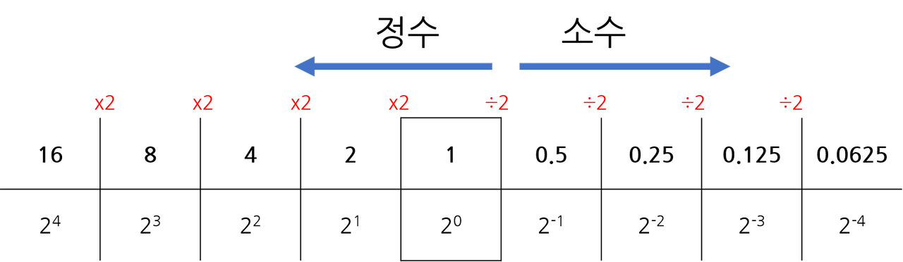
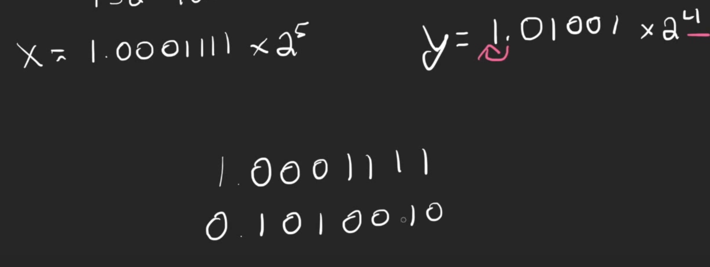

# 목차
1. 부동수소점 수의 표현
2. 부동소수점 산술 연산
3. 덧셈과 뺄셈
4. 곱셈과 나눗셈
  

## 부동소수점 수의 표현
소수점 위치를 이동 시키는 일종의 "수 표현의 방법"을 의미한다고 한다.

모두가 알듯이, 컴퓨터는 1과0을 값으로만 받아들인다! 
따라서 UInt나 Int 값은 표기하거나 표시하기 쉬워보인다. 
하지만, 소수점은 어떻게 표현할까? 
 
10진법으로 이루어진 숫자를 2진법으로 변경하는 과정에서 발생하는 문제점이 많다. 
255는 1111111으로 표현이 되지만
0.3 같은 수를 표현할 경우 끝없이 내려가는 경우가 발생한다. 
**따라서 컴퓨터는 그나마 가까운 값을 저장하게 되는 것이다.**
 

이때, 부동소수점의 기반이 되는 고정 소수점(fixed Point)이 활용되는데,  컴퓨터가 소수점을 저장하기 위한 방법으로 사용된다.

    
### - 고정 소수점
인간은 0과 1만 값으로 받아들이는 컴퓨터에게 소수점 구분과 편의성을 위해  32bit의 경우 중앙에 소수점을 배치하는 fixed point를 두게 된다.

  이들은 간단하게 3가지 파트로 설명이 되는데,  

**맨 앞의 1은 부호를 결정하는 S(부호부) 
.앞까지 반복되는 영역은 정수를 결정하는 E(지수부) 
소수점 이하 자리는 M(가수부)** 라 칭한다. 
  
**_이 소수점이 정수와 소수점을 구분하게 되는데, 8bit의 구조를 가정해보자._** 
 2.5를 표현한다면 고정 소수점을 활용하여
 0010.1000으로 계산이 된다. 
소수점을 기점으로 2를 의미하는 2¹과 0.5를 의미하는 2(1/2)의 합으로 2.5를 표현하는 것.

* 8비트 기준으로 16을 표시할 경우 오버플로우라는 것이 발생하는데,  정수와 소수부가 나뉘에 제한된 값을 가지기 때문에 8비트에서 2진수로 소수점을 표현할 수 있는 최대 값이 15.9375이기 때문이다. (1111.1111) 
 

 
만약 9.6875를 예시로 든다면 
[0]이 양수 부호를, 
[000000000001001]이 숫자 9를, 
[1011000000000000]이 소수점 뒤의 값6875를 표현하게 되는 것이다.
  
이처럼 fixed Point는 일종의 가이드 개념으로, 
0과 1로 이루어진 컴퓨터 숫자에서 소수 시작 지점을 정한 것으로 이해할 수 있다.  이 fixed point는 하지만 부동소수점에서 다르게 사용된다!
  

### 부동 소수점
부동 소수점은 위에 설명한대로 "수 표현의 방법"이다.
고정 소수점보다 더 적거나 거대한 값을 표시할 수 있는 방법인데,  고정 소수점을 이동하여 값의 범위를 늘리거나 줄일 수 있게 된다.  
예를 들어 32bit의 경우, 
**맨 앞의 1비트는 부호를 결정하는 S(부호부) 
뒤이어 오는 8비트는 정수를 결정하는 Exponent(지수부) 
그 이후의 23비트는 Mantissa(가수부)라 칭한다.**  
*고정 소수점과 달리 정수를 표현할 수 있는 비트 수가 줄어듦으로써 정수 표현 범위는 -127~128로 고정*이 된다고 한다.
  부동 소수점은 가수부 영역에서 실질적인 값을 표현하는데, 
소수점의 위치를 알리는 제곱승이 들어가 있다.

고정 소수점의 경우, 정수와 소수가 함께 공존한다면 
예) 정수 >12.345< 소수  
부동소수점은 가수와 지수로 표현된다. 
가수 > 1.xxx X 2ⁿ < 지수
 
결국 물리적인 규칙으로 인해 나뉜 고정 소수점과 달리
부동소수점은 가수부가 23비트나 할당이 되기에 실질적인 값은 더 많이 표현된다.
  
## 부동소수점 산술 연산
부동 소수점 산술 연산을 하기 위해서는 부동소수점 값을 정규화해야 한다. 
이는 가수부 앞의 값이 1이 되도록 조정을 해야하는데, 이를 위해 비트들을 왼쪽으로 이동 시키거나 오른쪽으로 이동을 시켜야 한다.

고정 소수점으로 표현된 263.3을 부동소수점으로 표현한다면 앞의 값이 1이 되도록 조정되어야 한다. 
따라서 2진수로 먼저 변화을 하는데, 
주어진 정수부에서 10000111을 넣고 남는 영역에 0을 채운다.

이후, 소수점을 구하여 - 0.3이 01001의 반복으로 되는 점을 확인할 수 있다. 
따라서 값은 (0)(000000100000111)(0100110011001100)으로 표현이 되는데, 
1이 앞으로 이동 될 수 있도록 2의 8승으로 곱하여 1.00000111010011001100110으로 만든다.
 
여기서 덧셈과 뺄셈의 과정은

1. 작은 지수의 값을 가진 지수를 큰 지수와 일치시킨 뒤

2. 유효자리를 서로 더한다.

3. 값을 정규화하여 더한다!