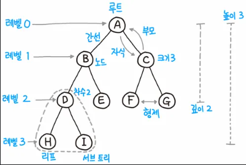
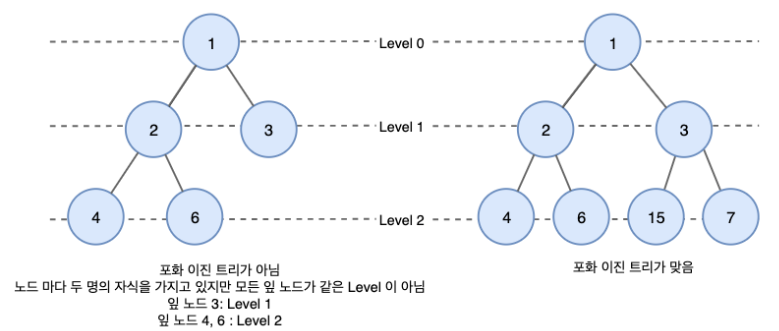
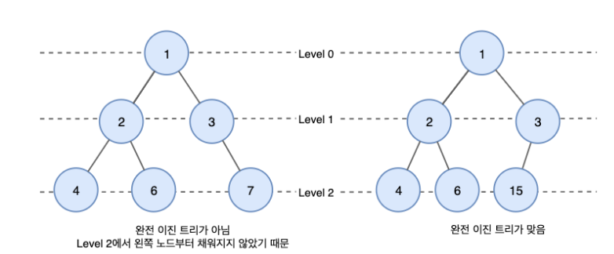
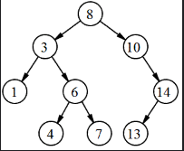
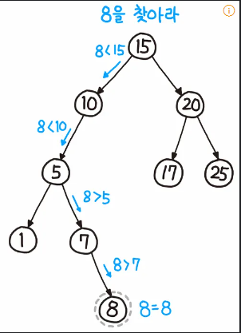
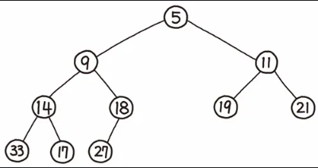

# 목차 
[1. 프로그램 성능평가](#1-프로그램-성능평가) <br>
[1-1. 점근적 표기법](#1-1-점근적-표기법-asymptotic-notation) <br>
[2. 시간 복잡도](#2-시간-복잡도-time-complexity) <br>
[2-1. 빅 오 함수의 종류](#2-1-시간복잡도-빅-오-표기법-함수의-종류) <br>
[3. 공간 복잡도](#3-공간-복잡도-space-complexity) <br>

# 1. 트리를 사용하는 이유

트리(Tree)란, 배열, 링크드리스트, 스택, 큐와 같이 일직선 개념의 자료구조가 아니라 부모-자식 개념을 가지는 자료구조이다. 최상위에 잇는 노드를 루트 노드라고 하며 루트 노드는 부모를 가지지 않는다.

데이터를 저장할 수 있으며 시간복잡도 상으로 우수하기 때문에 여러가지 부수적인 자료구조나 알고리즘을 만드는데도 사용된다.

이진트리란 자식노드가 최대 두 개인 노드들로 구성된 트리입니다.

이진트리가 중요한 이유는 매우 간단해서, 

N링크법을 사용하는 트리에 비해 문제를 일으킬 상황이 적다.

시간 복잡도 면에서 N링크법에 밀리지만 사용성과 편리성이 앞선다


# 2. 용어 정리

<br/>

노드(node): 트리를 구성하는 기본 원소

루트 노드(root node/root): 트리에서 부모가 없는 최상위 노드, 트리의 시작점

부모 노드(parent node): 루트 노드 방향으로 직접 연결된 노드

자식 노드(child node): 루트 노드 반대방향으로 직접 연결된 노드

형제 노드(siblings node): 같은 부모 노드를 갖는 노드들

리프 노드(leaf node/leaf): 루트 노드를 제외한 차수가 1인 정점을 뜻한다. 쉽게 말해 자식이 없는 노드. 단말 노드라 부르기도 한다.

경로(path): 한 노드에서 다른 한 노드에 이르는 길 사이에 있는 노드들의 순서

길이(length): 출발 노드에서 도착 노드까지 거치는 간선의 개수

깊이(depth): 루트 경로의 길이

레벨(level): 루트 노드(level=0)부터 노드까지 연결된 간선 수의 합

높이(height): 가장 긴 루트 경로의 길이

차수(degree): 각 노드의 자식의 개수

트리의 차수(degree of tree)

크기(size): 노드의 개수

너비(width): 가장 많은 노드를 갖고 있는 레벨의 크기

내부 정점(internal vertex): 차수가 2 이상인 정점을 뜻한다.

포레스트(forest): 서로 독립인 트리들의 모임이다.

방향 트리(directed tree): 방향을 무시하고 생각했을 때 트리인 유향 그래프는 방향 트리이다. 자료구조의 트리는 방향 트리의 일종이다

# 3. 자료구조

부모 노드 밑에 여러 자식 노드가 연결되고, 자식 노드 각각에 다시 자식 노드가 연결되는 재귀적 형태의 자료구조다. 단, 자식 노드의 자식이 부모로 연결되는 경우는 보통 트리로 인정하지 않는다. 트리는 몇가지 기본적이며 재미있는 성질을 갖고 있는데, 트리구조에서 어떤 노드를 빼 버리면 그로 인해 새로 생성되는 연결되지 않은 트리의 개수는 해당 노드에 연결된 에지의 개수와 같다.

자식 노드에서 부모 쪽으로 계속해서 타고 올라가다 보면 결국 부모가 없는 하나의 노드로 이어지게 되는데, 이 노드를 루트 노드(root node)라고 부르며, 루트 노드를 중심으로 뻗어나가는 모습이 나무의 구조와 비슷하여 '트리'라는 이름이 붙었다. '수형도(樹形圖)'라고 부르기도 한다.

# 4. 이진 트리의 종류

<br/>

정 이진 트리(full binary tree): 모든 트리의 자식은 0개나 2개다.

<br/>

포화 이진 트리(perfect binary tree): 모든 리프 노드의 높이가 같고 리프 노드가 아닌 노드는 모두 2개의 자식을 갖는다. 이진 트리에서 리프 높이의 최대치가 n일 때 가장 많이 존재할 수 있는 노드의 수는 2^n−1개인데 포화 이진 트리는 이 개수를 모두 채운 이진 트리라고도 볼 수 있다. 또한, 모든 포화 이진 트리는 정 이진 트리이다.

<br/>

완전 이진 트리(complete binary tree): 모든 리프노드의 높이가 최대 1 차이가 나고, 모든 노드의 오른쪽 자식이 있으면 왼쪽 자식이 있는 이진트리이다. 다시 말해 트리의 원소를 왼쪽에서 오른쪽으로 하나씩 빠짐없이 채워나간 형태이다. 포화 이진 트리는 완전 이진 트리의 부분집합이다. 단, 포화 이진 트리가 아닌 완전 이진 트리는 정 이진 트리일 수도 있고 아닐 수도 있다.

# 4.1.1 이진 트리 순회 방법

중위 순회(in-order traversal): 왼쪽 자손, 자신, 오른쪽 자손 순서로 방문하는 순회 방법. 이진 탐색 트리를 중위 순회하면 정렬된 결과를 얻을 수 있다.

전위 순회(pre-order traversal): 자신, 왼쪽 자손, 오른쪽 자손 순서로 방문하는 순회 방법.

후위 순회(post-order traversal): 왼쪽 자손, 오른쪽 자손, 자신 순서로 방문하는 순회 방법.

레벨 순서 순회(level-order traversal): 너비 우선 순회(Breadth-First traversal)라고도 한다. 노드를 레벨 순서로 방문하는 순회 방법. 위의 세 가지 방법은 스택을 활용하여 구현할 수 있는 반면 레벨 순서 순회는 큐를 활용해 구현할 수 있다.

<br/>

In-order: 1 3 4 6 7 8 10 13 14

Pre-order: 8 3 1 6 4 7 10 14 13

Post-order: 1 4 7 6 3 13 14 10 8

Level-order: 8 3 10 1 6 14 4 7 13

# 4.1.2 이진 탐색 트리

이진 트리의 일종으로, 노드의 왼쪽 가지에는 노드의 값보다 작은 값들만 있고, 오른쪽 가지에는 큰 값들만 있도록 구성되었다. 자식 노드들도 동일한 방법으로 정렬되어 노드의 왼쪽 자식의 왼쪽 가지에는 왼쪽 자식이 가진 값보다 작은 값만 있고, 왼쪽 자식의 오른쪽 가지에는 왼쪽 자식의 값보다 큰 값들만 있고, 오른쪽 자식의 왼쪽 가지에는… 이런 식으로 이진 탐색 트리의 어느 노드를 잡아도 동일한 규칙으로 정렬이 되어 있다.

<br/>

이렇게 구성해 두면 어떤 값 n을 찾을 때, 루트 노드와 비교해서 n이 더 작다면 루트 노드보다 큰 값들만 모여 있는 오른쪽 가지는 전혀 탐색할 필요가 없다. 마찬가지로 루트 노드의 왼쪽 자식보다 n이 크다면 왼쪽 자식의 왼쪽 가지는 탐색할 필요가 없고… 다시 말해 트리 자체가 이진 탐색을 하기에 적합한 구성이 되는 것이다. 또한 값을 찾을 때뿐만이 아니라 값을 삽입하거나 삭제할 때도 똑같은 과정을 거치므로, 이상적인 상황에서 탐색/삽입/삭제 모두 시간복잡도가 O(logN)이 된다.

<br/>

이진 탐색 트리를 이용해 원하는 값(여기서는 8)을 찾는(탐색하는) 과정은 위 그림과 같다. 이 그림에서 먼저, 루트는 15이며, 8은 15보다 작다. 따라서 왼쪽 자식 노드를 탐색한다. 10 또한 마찬가지로 8보다 크므로, 왼쪽을 택한다. 5는 8보다 작으므로, 오른쪽으로 탐색한다. 그 다음, 7은 8보다 작으므로 마지막으로 오른쪽을 탐색해 정답 8을 찾아낸다. 이 처럼 단 4번 만에 정답을 찾을 수 있다. 만약 6을 찾는다면(여기서는 정답이 없는) 5 이 후에 오른쪽을 탐색하게 될 것이고, 그다음에는 7, 이후에 다시 왼쪽을 탐색하려 하는데, 더 이상 왼쪽 노드가 없으므로 탐색을 중단하고 ‘정답 없음’을 출력하게 될 것이다.

다만 단점이 있는데, 값이 삽입되거나 삭제되는 경우에 따라서 운이 안좋으면 최악의 경우에 O(N)의 시간이 걸리게 된다. 예를 들어, 비어있는 이진 탐색 트리에 1부터 100까지 순서대로 삽입한다면 처음 루트 노드는 1이 되고, 2는 1보다 크니 1의 오른쪽 자식이 되고, 3은 1보다 크니 1의 오른쪽, 2보다 크니 2의 오른쪽… 이런 식으로 트리의 오른쪽 끝으로만 계속 성장하게 된다. 이 상태로 50을 찾는다고 하면 결국 1부터 순서대로 오른쪽으로 쭈욱 내려가는 선형 탐색이나 다를게 없게 된다. 이러한 경우를 트리가 편향(skew)되었다고 한다.

# 4.1.2.1 AVL-tree

가장 처음으로 나온 자가 균형 이진 탐색 트리로, 이진 탐색 트리가 운이 안 좋을 경우 O(N)의 시간이 걸리는 것을 보완한 트리이다.이상적인 상황에서나 최악의 상황에서 탐색/삽입/삭제 모두 시간 복잡도가 logO(logN)이다. 만족해야 하는 조건은 모든 노드에서 오른쪽 트리와 왼쪽 트리의 높이(height)의 차이가 1 이하로만 나는 것. 삽입/삭제를 할 때마다 균형이 안 맞는 것을 맞추기 위해 트리의 일부를 왼쪽 혹은 오른쪽으로 회전시켜야 한다.

# 4.1.3 힙(heap)

<br/>

영단어 힙(heap)은 '무엇인가를 차곡차곡 쌓아올린 더미'라는 뜻을 지니고 있다. 힙은 항상 완전 이진 트리의 형태를 띠어야 하고, 부모의 값은 항상 자식(들)의 값보다 크거나(Max heap 최대 힙), 작아야(Min heap 최소 힙)하는 규칙이 있다. 그러므로 사진은 최소 힙(Min heap)이다. 따라서 루트노드에는 항상 데이터들 중 가장 큰 값(혹은 가장 작은 값)이 저장되어 있기 때문에, 최댓값(혹은 최솟값)을 O(1)안에 찾을 수 있다.

단순히 최댓값(최솟값)을 O(1)안에 찾기 위해서라면 "항상 완전 이진 트리의 형태여야 한다"는 조건을 만족시킬 필요는 없다. 완전 이진 트리를 사용하는 이유는 삽입/삭제의 속도 때문이다. 물론 '힙 트리'는 정의상 완전 이진 트리를 사용하는 트리다. 달리 다른 구조를 사용한다 해도 전혀 얻을게 없는 최적의 구조이기 때문이다.


트리의 노드가 될 자료구조부터 정의

```swift
class TreeNode<T: Comparable> {
    let data: T
    var leftChild: TreeNode?
    var rightChild: TreeNode?
    
    init(data: T) {
        self.data = data
    }
    
    var asString: String {
        return treeString(self) { ("\($0.data)", $0.leftChild, $0.rightChild) }
    }
}
```

노드 추가
```swift
private func add(newNode: TreeNode<T>, to node: TreeNode<T>) {
        var queue = Queue<TreeNode<T>> ()
        queue.push(root!)
        
        while !queue.isEmpty {
            let now = queue.pop()
            if now?.leftChild == nil {
                now?.leftChild = newNode
                return
            }
            if now?.rightChild == nil {
                now?.rightChild = newNode
                return
            }
            queue.push(now!.leftChild!)
            queue.push(now!.rightChild!)
        }
    }
```
전위 순회 결과
```swift
private func printPreorder(node: TreeNode<T>?) {
        guard let node = node else { return }
        print(node.data, terminator: " ")
        self.printPreorder(node: node.leftChild)
        self.printPreorder(node: node.rightChild)
    }
```
중위 순회
```swift
 private func printInorder(node: TreeNode<T>?) {
        guard let node = node else { return }
        self.printInorder(node: node.leftChild)
        print(node.data, terminator: " ")
        self.printInorder(node: node.rightChild)
    }
```
후위 순회
```swift
 private func printPostorder(node: TreeNode<T>?) {
        guard let node = node else { return }
        self.printPostorder(node: node.leftChild)
        self.printPostorder(node: node.rightChild)
        print(node.data, terminator: " ")
    }
```
