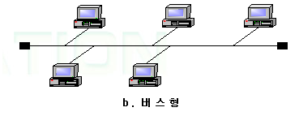
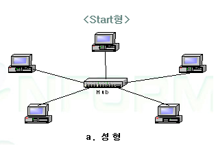

# 이더넷과 무선 LAN

## 들어가기 앞서...
홍다희님과 겹치는 내용이 많아 하나로 통합한 노션 페이지가 있습니다!
확인을 먼저 해보시는 것을 추천 드릴께요!

https://www.notion.so/LAN-ce69f59117a04995941dec7b08ce6442?pvs=4
  

### 이더넷 (Local Area Network)이란?
- 가장 대표적인 컴퓨터 네트워크 기술 중 하나로 케이블 선을 통해 데이터를 전달 받고 연결되어 있도록 도와주는 기술이라고 한다. 이 때 MAC(Media Access Control Address) 주소를 통해 어떤 이더넷을 활용하는지 특정한다고 하는데 - 더 알아가보자! 
- 선으로 연결이 되어 저렴한 비용 대비 빠른 네트워크 속도를 자랑하는데, 공공기관이나 빠른 네트워크가 필요한 사용자들이 이더넷을 애용한다.
*단, 기기에 직접 선이 물려 있어야 하기에 이동 반경에 제한이 생긴다. (MOBILE ❌)
  

- 어떤 선을 사용하는지에 따라 인터넷 속도가 다 다른데, 초기에는 coaxial cable을 사용했지만
 시간은 흘러 twisted pair cable, fiber optic cable 등을 사용하게 되었다고 한다.

### ➡ 단순하게 정리하면 로컬 환경의 컴퓨터 및 기타 장치를 네트워크에 연결하기 위해 만들어진 통신 표준이다!
 

___
### 이더넷 연결 형식(추가 공부 중!)
  
**- 버스형(Bus topology) **
하나의 전송매체로 여러 기기를 연결하는 방식으로 예전에 사용되던 방식이다.
하나의 전송매체로 여러 기기에게 데이터를 전달하다보니 충돌이 발생하게 되는데, CSMA/CD (Carrirer Collision Detector)를 통해 데이터를 전송한다고 한다.
아울러 버스 형식은 타이밍 제어방식이기에 데이터가 먼저 도달하는 기기가 데이터를 가지게 된다고.
  
  
**- 스타형(Star topology) **
하나의 스위치가 중심  허브 역할을 하며 기기들을 연결하는 방식이다.
케이블이 여러개 사용되다보니 비용이 많이드는 반면, 충돌이 발생하거나 데이터를 올바르게 뿌릴 수 있어 대부분 버스형에서 스타형으로 옮겨가는 과정이라고 한다.
  
___
### 이더넷 연결을 돕는 장치들
이더넷은 기기들에게 네트워크 연결을 도와주는 장치인만큼 기기들은 네트워크 연결을 받기 위해서는 특수한 장치가 내제되어 있거나 추가해야한다.

**NIC(Network Interface Card)** 
- 별도로 내제되어 있지 않는 경우, 별도로 부착이 가능한 이 장치는 사설 네트워크 연결을 돕는다. 데이터를 여러 기기들끼리 연결해주는 라우터에게 전달이 되도록 디지털 신호로 변환하는 역할을 하는데,  MAC 주소를 제공하여 기기의 고유한 식별 주소를 제공하여 IP주소처럼 데이터를 끝과 끝이 받을 수 있도록 돕는다.

**라우터** 
기기들을 연결하는 라우터에는 여러 장치들이 존재하는데, 게이트웨이는 다른 주소 위치에 존재하는 장치들끼리 연결해주는 

**Bridge** 

### 무선LAN이란?
- 유선 케이블 없이 LAN을 연결해주는 기기로 선이 아닌 전파로 연결을 해준다.
무선 LAN에는 데이터를 전달하는 방식이 2가지가 있는데 Infrastructure과 Ad hoc으로 나뉜다.
  

**Infrastructure** 
인프라는 무선 LAN access point로 기기에서 식별 변호를 통해 접속 가능 여부를 확인하는 과정을 거친다
  **AdHoc** (아직 이해 x) 
애드훅에서 단말기끼리 연결을 할 수 있도록 통신을 모바일끼리 연결한다고 한다.

### 참고 
- https://www.youtube.com/watch?v=HLziLmaYsO0
- https://velog.io/@learningssik/초심자를-위한-네트워크-설명-4-이더넷과-무선-LAN
- https://deveun.tistory.com/entry/Network-이더넷Ethernet이란
- https://jhnyang.tistory.com/404
- https://m.blog.naver.com/jchyuncorp/222033619668